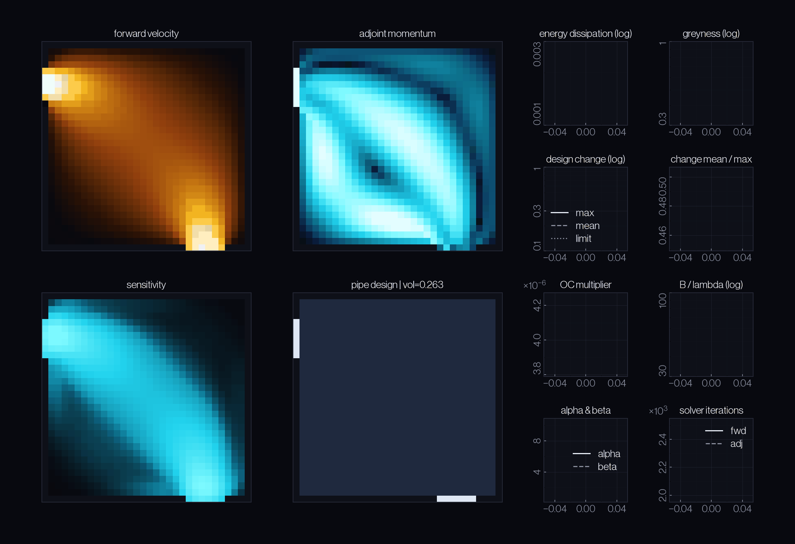
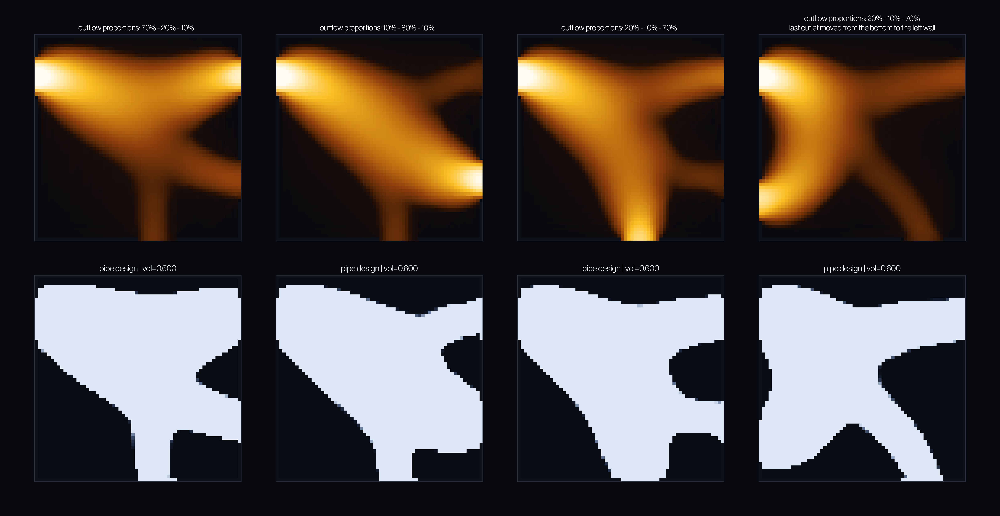
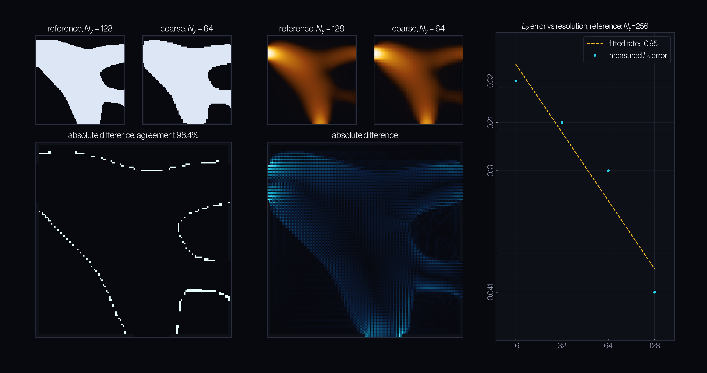

# Adjoint lattice Boltzmann topology optimization

Generate 2D pipe networks by giving the solver only the inlets, the outlets, and a material budget. It returns the geometry that minimises energy dissipation.

Built as a URSS 2026 project at the University of Warwick under Dr Radu Cimpeanu.

  

## What it is

A discrete-adjoint topology-optimization loop built on a lattice Boltzmann flow solver.

Two repositories:

- [`lbm-2d-python`](https://github.com/r-i-p-dance/lbm-2d-python) — the LBM solver, verified on Poiseuille flow and on obstacle benchmarks.
- [`topopt-lbm-python`](https://github.com/r-i-p-dance/topopt-lbm-python) — the topology optimizer, built on top.

## Results

### Pipe bend

The pipe bend is the standard benchmark in fluid topology optimization — an inlet on the west wall, an outlet on the south wall, and a material budget. It appears in Borrvall & Petersson's founding paper and in most work since, which makes it the natural case to build and validate against.

  

Every component was developed and verified here first — the adjoint transposes, the optimality criteria update, the continuation schedule, the sensitivity filter. Only once the bend converged reliably did the formulation extend to the more interesting flow distributor application.

### Flow distributor

The problem was inspired by the field of microfluidics, where devices such as lab-on-a-chip systems often need one incoming stream divided between several outlets in fixed proportions.

In this implementation, flow rates are prescribed directly for two outlets, and the third is set by pressure, anchoring the density field to let mass conservation close the balance.

  

Once the algorithm is ready, the setup is customizable. The plots show the diversity of designs generated with the same solver by setting different outflow proportions and assigning outlets to different walls.

### Mesh independence

  

We verified the flow solver in the [`lbm-2d-python`](https://github.com/r-i-p-dance/lbm-2d-python) repository. To verify the produced design, we ran the same problem at five resolutions and compared each to the finest.

Between 95.3% and 99.3% of cells agree on solid versus fluid, from the coarsest grid to the second-finest.

The disagreement is entirely on the boundaries. Coarse and fine designs place the same channels in the same places. The flow follows — velocity differences sit in the boundary layers and vanish in the channel interior.

The filter radius fixes the smallest feature a design may contain. Held constant as a fraction of the grid, the same physical design appears at every resolution — refined, not reinvented.

## How it works

### Design as a density field

Every cell in the grid carries a continuous variable between 0 and 1. The solver interprets it as friction: at 1 the fluid passes freely; at 0 it is brought to rest. Nothing is ever cut away — cells simply become impassable, and the pipe is whatever path the fluid is still allowed to take. Because the field is continuous, it is differentiable.

### The algorithm

1. Simulate the flow with LBM.
2. Solve the adjoint — a second simulation, run backwards, that carries the objective back through the flow.
3. Construct the sensitivity field: how changing each cell's density decreases energy dissipation.
4. Update every cell. Iterate until dissipation and greyness both settle.

### Why the adjoint

Testing each cell individually would need one full simulation per cell — 4096 of them on a 64×64 grid. Using the adjoint method makes the cost of finding sensitivities independent of the total number of design variables. 

**We verified the adjoint gradient matches the finite difference calculation exactly.**

### Method stack

**Optimization** — Brinkman penalisation, discrete adjoint, optimality criteria optimizer with volume constraint, sensitivity filter, continuation on Brinkman penalisation and Heaviside projection.

**Boundaries** — parabolic velocity inlet, Zou–He velocity outlets set to a fraction of inlet flux, one pressure outlet as the density anchor, adjoint boundary conditions after Luo et al.

## Motivation

Engineering is slow because it is iterative. Draft, simulate, refine, repeat. What if the rules could be encoded, and the structure generated instead of designed by hand?

The aim was to build a solver that designs 2D pipes given only the inlets, the outlets, and constraints on how much material can be used. Given only inlets, outlets, and a material budget, the workflow produces a manufacturable geometry with no shape drawn by hand.

The solver has applications across engineering, including microfluidics. Potential extensions: heat transfer, multiple objectives, 3D.

## References

The foundational literature for the project.

1. Krüger, T. et al. (2017) — *The Lattice Boltzmann Method: Principles and Practice.* Springer. [10.1007/978-3-319-44649-3](https://doi.org/10.1007/978-3-319-44649-3) — the solver.
2. Zou, Q. & He, X. (1997) — On pressure and velocity boundary conditions for the lattice Boltzmann BGK model. *Physics of Fluids* 9(6). [10.1063/1.869307](https://doi.org/10.1063/1.869307) — the boundary conditions.
3. Bendsøe, M.P. & Sigmund, O. (2003) — *Topology Optimization: Theory, Methods, and Applications.* Springer. [10.1007/978-3-662-05086-6](https://doi.org/10.1007/978-3-662-05086-6) — topology optimization.
4. Borrvall, T. & Petersson, J. (2003) — Topology optimization of fluids in Stokes flow. *IJNMF* 41(1). [10.1002/fld.426](https://doi.org/10.1002/fld.426) — fluid topology optimization.
5. Pingen, G., Evgrafov, A. & Maute, K. (2007) — Topology optimization of flow domains using the lattice Boltzmann method. *Struct Multidisc Optim* 34(6). [10.1007/s00158-007-0105-7](https://doi.org/10.1007/s00158-007-0105-7) — LBM + topology optimization.
6. Giles, M.B. & Pierce, N.A. (2000) — An Introduction to the Adjoint Approach to Design. *Flow, Turbulence and Combustion* 65. [10.1023/A:1011430410075](https://doi.org/10.1023/A:1011430410075) — discrete vs continuous adjoint.
7. Luo, J.-W. et al. (2025) — Improved adjoint lattice Boltzmann method for topology optimization of laminar convective heat transfer. *IJHMT* 251. [10.1016/j.ijheatmasstransfer.2025.127315](https://doi.org/10.1016/j.ijheatmasstransfer.2025.127315) — consistent adjoint boundary conditions.
8. Wang, F., Lazarov, B.S. & Sigmund, O. (2011) — On projection methods, convergence and robust formulations in topology optimization. *Struct Multidisc Optim* 43(6). [10.1007/s00158-010-0602-y](https://doi.org/10.1007/s00158-010-0602-y) — projection and continuation.
9. Müller-Brockmann, J. (1981) — *Grid Systems in Graphic Design.* Niggli. ISBN 978-3-7212-0145-1 — poster typography.

## Acknowledgements

Supervised by Dr Radu Cimpeanu at the University of Warwick. Funded by the Undergraduate Research Support Scheme (URSS) 2026.